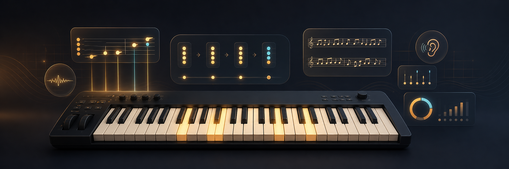

# ACORDE 3

**Profesor interactivo de piano moderno con feedback MIDI, ruta diaria y práctica armónica.**

[Abrir la aplicación](https://acorde-midi-lab.zegarr96.chatgpt.site/) · [Ver el repositorio](https://github.com/zegarr/acorde-midi-lab)

ACORDE 3 convierte el navegador en un espacio de estudio para aprender piano moderno desde los fundamentos hasta armonía y voicings avanzados. La aplicación muestra qué notas tocar, escucha un teclado MIDI en tiempo real, identifica notas y acordes, evalúa cada intento y organiza el aprendizaje en sesiones breves.

Está pensada especialmente para un **Alesis Q49**, aunque funciona con cualquier controlador que el navegador exponga mediante Web MIDI. También se puede usar sin hardware desde el teclado visual.

## Qué incluye

- Ruta guiada de 5 niveles y 25 unidades.
- Sesiones diarias configurables de 10, 20 o 30 minutos.
- Entrenadores de técnica, ritmo, oído, lectura y aplicación musical.
- Diagnóstico MIDI inicial para elegir un punto de partida.
- Diccionario interactivo con 23 tipos de acordes, desde tríadas hasta trecenas.
- Acordes diatónicos calculados para las 12 tonalidades en modo mayor o menor.
- Inversiones, reconocimiento armónico y voicings con registro exacto.
- 15 progresiones de dificultad inicial, intermedia y avanzada.
- Reproducción de notas, acordes y vueltas completas con Web Audio.
- Timbres sintetizados de piano, piano eléctrico y órgano.
- Pentagrama renderizado con VexFlow.
- Metrónomo con cuenta previa y evaluación de precisión temporal.
- Calibración de dinámica mediante velocidad MIDI.
- Lectura opcional del pedal de sustain mediante MIDI CC64.
- Historial, metas, repasos y dominio guardados en `localStorage`.
- Exportación e importación del progreso en JSON.

## Cómo funciona

La interfaz se divide en cuatro espacios conectados:

### Ruta

Es el centro de aprendizaje. Cada sesión combina bloques breves de los cinco pilares para evitar que la práctica se convierta en una repetición mecánica de una sola habilidad.

1. **Técnica:** pentacordios, escalas, arpegios, inversiones y voicings.
2. **Ritmo:** pulso, metrónomo, anticipaciones, síncopas y comping.
3. **Oído:** reconocimiento y reproducción de acordes y funciones.
4. **Lectura:** notas en pentagrama, cifrado americano y lead sheets.
5. **Aplicación:** progresiones, conducción de voces e improvisación.

El diagnóstico inicial pide localizar Do central, construir Do mayor y tocar una escala ascendente. Se puede omitir para comenzar desde el nivel 1.

### Práctica

Es el laboratorio libre de acordes. Permite elegir la tonalidad, el modo, la familia del acorde y la inversión. El teclado en pantalla marca las notas objetivo y compara lo tocado con la estructura correcta.

El detector muestra siempre:

- las notas MIDI activas;
- el acorde o la combinación armónica reconocida;
- las notas que faltan;
- las notas adicionales;
- el bajo y la inversión cuando corresponde.

Los acordes están organizados en cuatro familias:

| Familia | Contenido |
| --- | --- |
| Base | mayor, menor, disminuido y aumentado |
| Séptimas | maj7, 7, m7, mMaj7, m7♭5 y dim7 |
| Extendidos | maj9, 9, m9, 7♭9, 11, m11 y 13 |
| Color | sus2, sus4, quinta, 6, m6 y add9 |

### Progresiones

Permite seleccionar tonalidad, modo y dificultad para practicar vueltas armónicas completas. Cada acorde muestra su grado, nombre, función y notas. Se puede escuchar la progresión entera o cada paso por separado antes de tocarla.

Al completar una vuelta, la aplicación marca cada acorde, registra la sesión y actualiza la meta diaria. El repertorio incluido abarca, entre otras:

- I–IV–V–I;
- I–V–vi–IV;
- I–vi–IV–V;
- cadencia menor y descenso andaluz;
- ii–V–I mayor y iiø–V–i menor;
- Imaj7–vi7–ii7–V7;
- dominantes secundarias;
- cadenas por quintas;
- progresiones con maj9, m9, 13 y dominantes alterados.

### Teoría

Explica los conceptos que hacen transferible la práctica a cualquier tonalidad:

- intervalos;
- construcción de tríadas;
- acordes de séptima;
- extensiones 9, 11 y 13;
- inversiones y conducción de voces;
- transposición mediante fórmulas.

Cada lección está enlazada con el laboratorio para pasar de la explicación al teclado sin cambiar de contexto.

## Ruta pedagógica

| Nivel | Etapa | Contenido principal |
| ---: | --- | --- |
| 1 | Fundamentos | mapa del teclado, pulso, pentacordios y tríadas |
| 2 | Acompañamiento | escalas de una octava, inversiones, pedal y patrones pop |
| 3 | Fluidez | arpegios, séptimas, síncopas, lead sheets y dos manos |
| 4 | Color | extensiones, ii–V–I, modos, comping e improvisación |
| 5 | Lenguaje | drop-2, voicings sin raíz, tensiones alteradas, reharmonización y modulación |

Cada etapa contiene una unidad por pilar. La aplicación registra precisión de notas, ritmo, velocidad, pedal, tempo y uso de ayudas.

### Criterio de progreso

- Un intento aprobado actualiza la sesión y programa un repaso.
- Dos ejecuciones correctas dejan una habilidad como **aprobada**.
- Una nueva aprobación en otro día la convierte en **dominada**.
- Un fallo programa el repaso para el día siguiente.
- Una habilidad aprobada vuelve a aparecer a los 3 días.
- Una habilidad dominada se revisa a los 14 días.
- Se conservan hasta 400 intentos recientes para calcular métricas.

Los ejercicios de reconocimiento aceptan inversiones u octavas equivalentes. Los ejercicios de voicing sí exigen las notas y el registro indicados. La digitación y la postura se ofrecen como guía, pero no se califican: MIDI no puede saber qué dedo físico se utilizó.

## Conectar un teclado MIDI

1. Conecta y enciende el controlador antes de abrir la conexión.
2. Abre la aplicación en **Chrome o Edge** mediante HTTPS o `localhost`.
3. Pulsa **Conectar MIDI**.
4. Acepta el permiso solicitado por el navegador.
5. Toca una nota: su nombre y cualquier acorde reconocido aparecerán inmediatamente.

### Alesis Q49

La vista del teclado sigue un registro de 49 teclas y se adapta a los cambios enviados desde los botones de octava. La velocidad de cada ataque se usa para los ejercicios de dinámica. Si hay un pedal conectado, el sustain se lee mediante CC64 y se muestra en la sesión, pero nunca bloquea el avance.

> Web MIDI no está disponible de forma uniforme en todos los navegadores. Si el dispositivo no aparece, prueba Chrome o Edge, recarga la página con el Q49 encendido y vuelve a conceder el permiso.

## Audio

El sonido se genera localmente con Web Audio; no se descargan samples ni se envían notas a un servidor. Hay tres variantes:

- **Piano:** ataque definido y caída rápida.
- **Eléctrico:** mezcla más suave y redonda.
- **Órgano:** sonido sostenido para escuchar mejor las voces internas.

Se pueden escuchar acordes individuales, ejercicios de oído, el acorde actual de una progresión o una vuelta completa.

## Datos y privacidad

ACORDE 3 no requiere cuenta, API ni base de datos. Todo el historial vive en el navegador bajo la clave:

```text
acorde-learning-v3
```

La primera carga puede migrar automáticamente datos existentes de `acorde-practice-v2`. El estado guardado incluye ajustes, historial de progresiones, perfil de aprendizaje, intentos, dominio y sesiones diarias.

Usa **Exportar** para descargar una copia JSON antes de limpiar el navegador o cambiar de equipo. Usa **Importar** para restaurarla. El progreso no se sincroniza automáticamente entre dispositivos.

## Desarrollo local

### Requisitos

- Node.js `>= 22.13.0`
- npm
- Chrome o Edge para probar Web MIDI

### Instalación

```bash
git clone https://github.com/zegarr/acorde-midi-lab.git
cd acorde-midi-lab
npm install
npm run dev
```

Abre la dirección local que muestra la terminal. Los permisos MIDI funcionan en `localhost`.

### Comandos

| Comando | Acción |
| --- | --- |
| `npm run dev` | inicia el entorno de desarrollo |
| `npm run build` | genera la compilación de producción |
| `npm test` | compila y ejecuta las pruebas automatizadas |
| `npm run lint` | analiza el código con ESLint |
| `npm run start` | sirve una compilación existente |

## Arquitectura

```text
app/
├── page.tsx          # interfaz, Web MIDI, Web Audio y lógica de práctica
├── learning.ts       # currículo, perfiles, intentos, dominio y sesiones
├── MusicStaff.tsx    # pentagrama SVG con VexFlow
├── globals.css       # sistema visual y adaptación responsive
└── layout.tsx        # metadatos y presentación social
public/
├── readme-header.png # cabecera del repositorio
└── og-learning.png   # imagen social de la aplicación
tests/
└── rendered-html.test.mjs
```

La aplicación es cliente primero: React mantiene el estado de la sesión, Web MIDI entrega eventos de notas y controladores, Web Audio sintetiza el sonido y `localStorage` conserva el progreso. No existe un backend de usuario.

### Tecnologías

- React 19 y Next.js 16
- TypeScript
- vinext y Vite
- Web MIDI API
- Web Audio API
- VexFlow 5
- CSS responsive sin biblioteca de componentes
- Node Test Runner

## Pruebas y compatibilidad

La suite de pruebas compila el proyecto y verifica el HTML renderizado, las secciones educativas principales, los controles MIDI y los elementos esenciales de accesibilidad. Antes de publicar cambios:

```bash
npm test
```

La interfaz está diseñada para escritorio y móvil, aunque la experiencia completa de ejecución se beneficia de una pantalla con suficiente ancho para visualizar las 49 teclas. Todos los controles principales tienen nombres accesibles y el teclado visual se puede usar cuando no hay MIDI disponible.

## Alcance actual

- No detecta audio por micrófono.
- No sincroniza datos entre navegadores o dispositivos.
- No puede evaluar postura ni digitación física.
- El pedal es opcional.
- Los sonidos son sintetizados en el navegador, no instrumentos sampleados.

---

**ACORDE 3** está construido para aprender la lógica musical y llevarla inmediatamente a las teclas: escuchar, entender, tocar, recibir feedback y volver a intentarlo.
